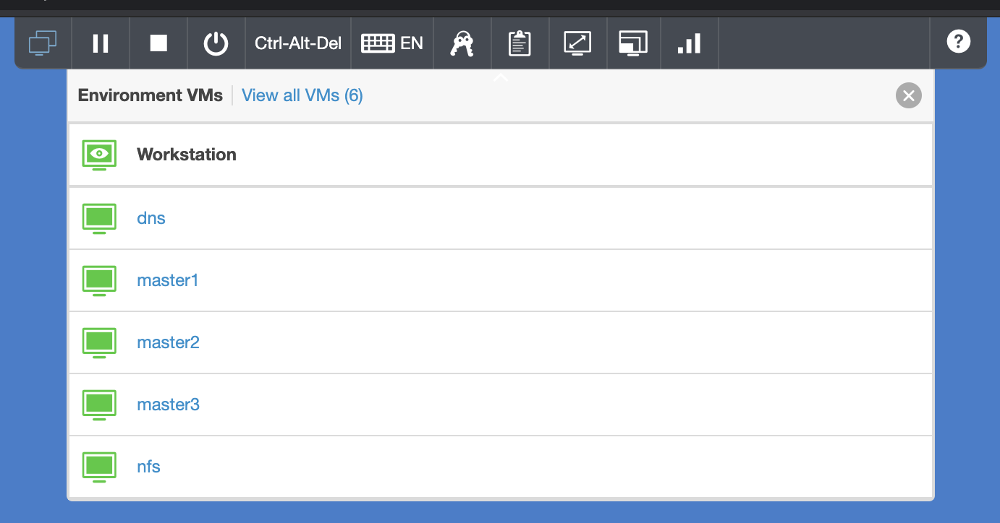
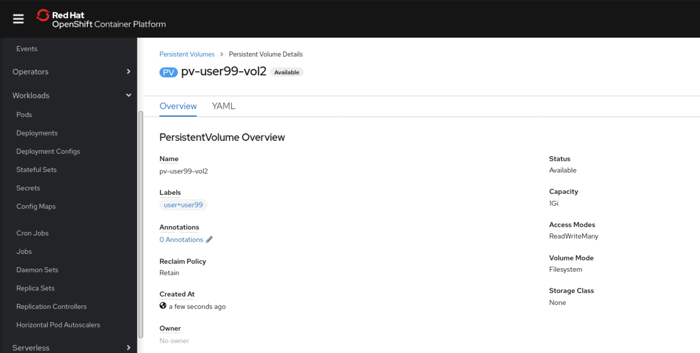
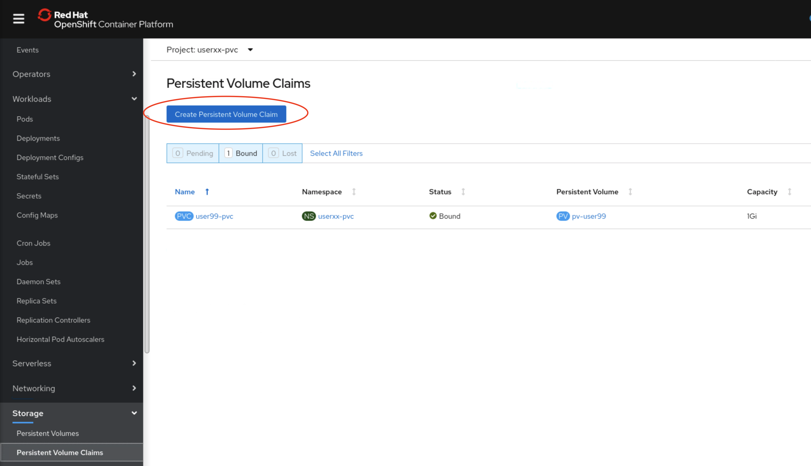
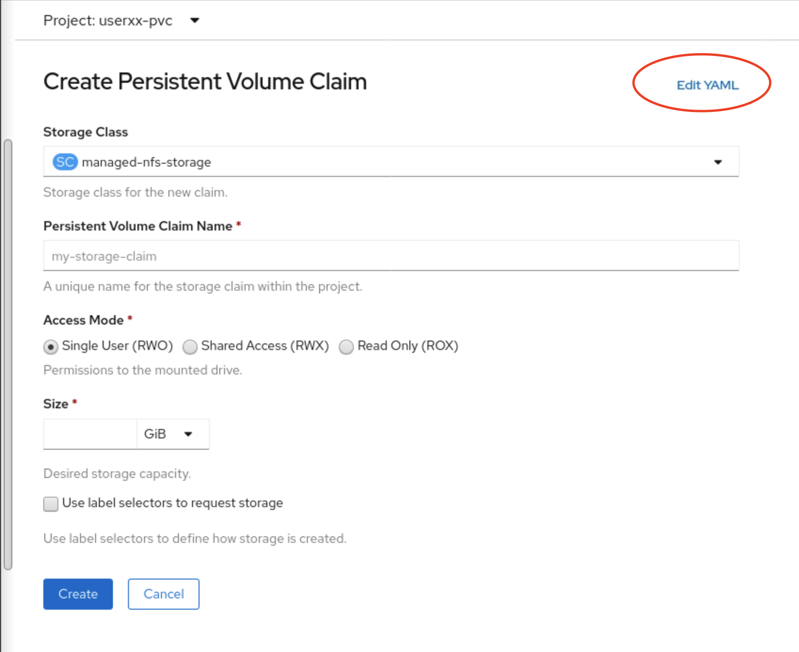
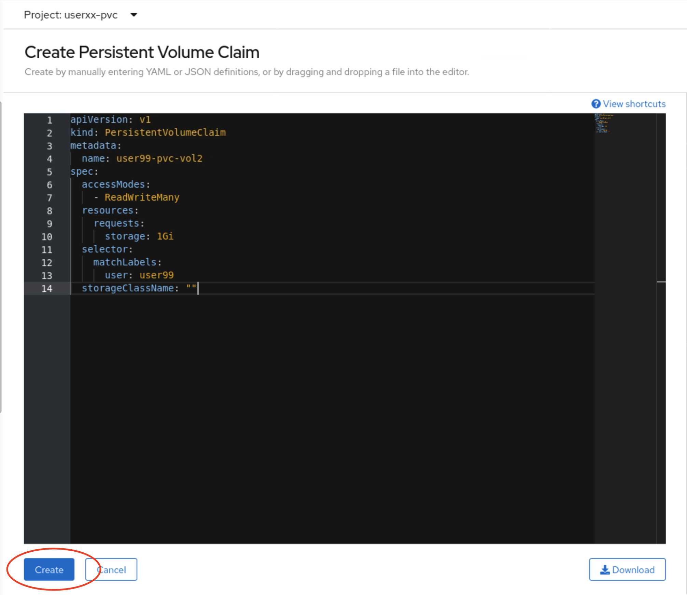
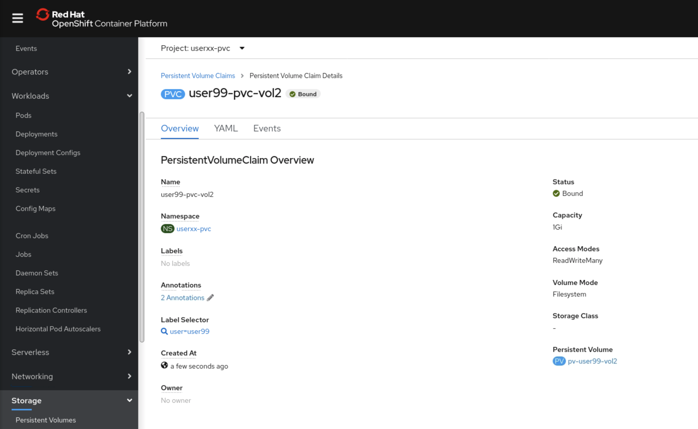

# Exercise 1 - Creating Static Storage in OpenShift

In this lab you'll create a Persistent Volume in OpenShift, then create an application to consume that storage using both the WebUI and command line.

To get started, log into OpenShift using the CLI, as described [here](../Getting-started/log-in-to-openshift.md).

A set of helpful common `oc` commands can be found [here](../Getting-started/oc-commands.md).

Once you're logged in, create a new project for this deployment.

```
$ oc new-project lab04-static-volume
```

Create a new local directory for this lab, and change to it.

```
$ mkdir -p Lab04/static-pv
$ cd Lab04/static-pv
```

For this task, you'll need to create an NFS export on the NFS server in your environment. Switch to the NFS server using the control panel at the top of the window, then select `nfs`



Log in with the user `ibmadmin` and the password `passw0rd`.

Create two new directories called `vol1` nd `vol2` in the `/nfs/` directory using `sudo`.

```
sudo mkdir /nfs/vol1
sudo mkdir /nfs/vol2
```

Retrieve the IP address of this VM, we'll need that at a later step.

```
$ ip addr
1: lo: <LOOPBACK,UP,LOWER_UP> mtu 65536 qdisc noqueue state UNKNOWN group default qlen 1000
    link/loopback 00:00:00:00:00:00 brd 00:00:00:00:00:00
    inet 127.0.0.1/8 scope host lo
       valid_lft forever preferred_lft forever
    inet6 ::1/128 scope host 
       valid_lft forever preferred_lft forever
2: ens34: <BROADCAST,MULTICAST,UP,LOWER_UP> mtu 1500 qdisc pfifo_fast state UP group default qlen 1000
    link/ether 00:50:56:2c:c9:c4 brd ff:ff:ff:ff:ff:ff
    inet 10.0.0.202/24 brd 10.0.0.255 scope global noprefixroute ens34
       valid_lft forever preferred_lft forever
    inet6 fe80::66d8:fb45:1ea3:823a/64 scope link noprefixroute 
       valid_lft forever preferred_lft forever
```

The IP here is `10.0.0.202`.

## Using the oc CLI

First we'll create a Persistent Volume (PV).

Create a new file `lab-pv.yaml` with the following content, replacing the `user99` value with your own user ID. This makes sure the associated PVC will bind to your PV.

```
kind: PersistentVolume
apiVersion: v1
metadata:
  name: pv-user99-vol1
  labels:
    user: user99
spec:
  capacity:
    storage: 1Gi
  nfs:
    server: 10.0.0.202
    path: /nfs/vol1
  accessModes:
    - ReadWriteMany
```

Create the PV using `oc create -f lab-pv.yaml` 

Use `oc get pv` to ensure the PV you just created says `Available`

```
$ oc get pv pv-user99-vol1
NAME             CAPACITY   ACCESS MODES   RECLAIM POLICY   STATUS      CLAIM   STORAGECLASS   REASON   AGE
pv-user99-vol1   1Gi        RWX            Retain           Available                                   105s
```

Next, we need to create a Persistent Volume Claim (PVC) that will bind to this PV. OpenShift will match an available PV to a new PVC by using several factors:

- Capacity
- Labels
- Access Mode
- Storage Class

Since we're not using a storage class, our PVC will get matched on the other three.

Create a new file `lab-pvc.yaml` with the following content

```
apiVersion: v1
kind: PersistentVolumeClaim
metadata:
  name: user99-pvc-vol1
spec:
  accessModes:
    - ReadWriteMany
  resources:
    requests:
      storage: 1Gi
  selector:
    matchLabels:
      user: user99
  storageClassName: ""
```

Note the use of storageClassName defined as an empty string. This tells OpenShift that we do not want to use any dynamic storage provisioner for this volume.

Create the PVC using `oc create -f lab-pvc.yaml` 

Check that the new PVC is now `Bound` to the desired PV.

```
$ oc get pvc
NAME              STATUS   VOLUME      CAPACITY   ACCESS MODES   STORAGECLASS   AGE
user99-pvc-vol1   Bound    pv-user99   1Gi        RWX                           3s
```

Now that we see the PVC is bound to the PV created earlier, we can go ahead and create an application to use that volume.

Create the following MySQL app

```
apiVersion: apps/v1
kind: Deployment
metadata:
  name: wordpress-mysql
  labels:
    app: wordpress
spec:
  selector:
    matchLabels:
      app: wordpress
      tier: mysql
  strategy:
    type: Recreate
  template:
    metadata:
      labels:
        app: wordpress
        tier: mysql
    spec:
      containers:
      - image: mysql:5.6
        name: mysql
        env:
        - name: MYSQL_ROOT_PASSWORD
          value: passw0rd
        ports:
        - containerPort: 3306
          name: mysql
        volumeMounts:
        - name: mysql-persistent-storage
          mountPath: /var/lib/mysql
      volumes:
      - name: mysql-persistent-storage
        persistentVolumeClaim:
          claimName: user99-pvc-vol1

```

Note the use of the following volume:
```
volumes:
- name: mysql-persistent-storage
  persistentVolumeClaim:
    claimName: user99-pvc-vol1
```

We have told the scheduler that we will use an existing PVC.

Inspect the newly created pods. It may have an error

```
$ oc get pods
NAME                               READY   STATUS        RESTARTS   AGE
wordpress-mysql-84b76fbf6b-t9pc4   0/1     Error               3          48s
```

Since the pod is in `ERROR` state, we know that the scheduler has already succesfully created the pod, assigned the required resources and found the correct Persistent Volume Claim we created earlier. So what could be wrong?

Inspect the pod logs to try to identify the root cause of why the pod cannot run properly. 

```
$ oc logs wordpress-mysql-84b76fbf6b-t9pc4
2020-06-28 16:14:32+00:00 [Note] [Entrypoint]: Entrypoint script for MySQL Server 5.6.48-1debian9 started.
2020-06-28 16:14:32+00:00 [Note] [Entrypoint]: Initializing database files
2020-06-28 16:14:32 0 [Warning] TIMESTAMP with implicit DEFAULT value is deprecated. Please use --explicit_defaults_for_timestamp server option (see documentation for more details).
2020-06-28 16:14:32 0 [Note] Ignoring --secure-file-priv value as server is running with --bootstrap.
2020-06-28 16:14:32 0 [Note] /usr/sbin/mysqld (mysqld 5.6.48) starting as process 29 ...
2020-06-28 16:14:32 29 [Warning] Can't create test file /var/lib/mysql/wordpress-mysql-84b76fbf6b-t9pc4.lower-test
2020-06-28 16:14:32 29 [Warning] Can't create test file /var/lib/mysql/wordpress-mysql-84b76fbf6b-t9pc4.lower-test
2020-06-28 16:14:32 29 [Note] InnoDB: Using atomics to ref count buffer pool pages
2020-06-28 16:14:32 29 [Note] InnoDB: The InnoDB memory heap is disabled
2020-06-28 16:14:32 29 [Note] InnoDB: Mutexes and rw_locks use GCC atomic builtins
2020-06-28 16:14:32 29 [Note] InnoDB: Memory barrier is not used
2020-06-28 16:14:32 29 [Note] InnoDB: Compressed tables use zlib 1.2.11
2020-06-28 16:14:32 29 [Note] InnoDB: Using Linux native AIO
2020-06-28 16:14:32 29 [Note] InnoDB: Using CPU crc32 instructions
2020-06-28 16:14:32 29 [Note] InnoDB: Initializing buffer pool, size = 128.0M
2020-06-28 16:14:32 29 [Note] InnoDB: Completed initialization of buffer pool
2020-06-28 16:14:32 7f575c59c040  InnoDB: Operating system error number 13 in a file operation.
InnoDB: The error means mysqld does not have the access rights to
InnoDB: the directory.
2020-06-28 16:14:32 7f575c59c040  InnoDB: Operating system error number 13 in a file operation.
InnoDB: The error means mysqld does not have the access rights to
InnoDB: the directory.
2020-06-28 16:14:32 29 [ERROR] InnoDB: Creating or opening ./ibdata1 failed!
2020-06-28 16:14:32 29 [ERROR] InnoDB: Could not open or create the system tablespace. If you tried to add new data files to the system tablespace, and it failed here, you should now edit innodb_data_file_path in my.cnf back to what it was, and remove the new ibdata files InnoDB created in this failed attempt. InnoDB only wrote those files full of zeros, but did not yet use them in any way. But be careful: do not remove old data files which contain your precious data!
2020-06-28 16:14:32 29 [ERROR] Plugin 'InnoDB' init function returned error.
2020-06-28 16:14:32 29 [ERROR] Plugin 'InnoDB' registration as a STORAGE ENGINE failed.
2020-06-28 16:14:32 29 [ERROR] Unknown/unsupported storage engine: InnoDB
2020-06-28 16:14:32 29 [ERROR] Aborting

2020-06-28 16:14:32 29 [Note] Binlog end
2020-06-28 16:14:32 29 [Note] /usr/sbin/mysqld: Shutdown complete
```

Inspecting logs can be a tedious, but necessary evil. In this particular example, we can see some obvious signs that something with the back end storage isn't quite right.

```
InnoDB: The error means mysqld does not have the access rights to
InnoDB: the directory.
```

These lines suggests that the MySQL service could not write to the directory, which might indicate that the storage administrator has not assigned the correct privileges to the NFS export we're using here. At this point, if you are not the storage admin, you should contact them to fix the issue. In this exercise, you have access to the NFS VM so you're able to fix the issue yourself.

Switch back to the NFS VM again, this time fixing the permissions on the `vol1` directory you created earlier.

```
sudo chmod 777 /nfs/vol1
```

Once the storage admin has addressed the issue, check the status of the pod

```
$ oc get pods
NAME                               READY   STATUS    RESTARTS   AGE
wordpress-mysql-84b76fbf6b-fbklv   1/1     Running   0          1
```

The pod is now running.

If the failed pod does not restart quick enough, you can delete the pod manually to speed up the process using `oc delete pod <name>`.

This is a common scenario when creating storage manually without a dynamic storage provisioner taking care of monotonous actions for us and it's possible to make some mistakes. In this case, the storage admin did not modify the storage permissions correctly to allow the container to run. Once this was fixed, the pods could start properly.

## Using the UI

Navigate to Storage > Persistent Volumes in the navigation pane. 


This screen will present you with some YAML we'll use to create the PV specification.

Adapt the default YAML to look similar to the following

```
kind: PersistentVolume
apiVersion: v1
metadata:
  name: pv-user99-vol2
  labels:
    user: user99
spec:
  capacity:
    storage: 1Gi
  nfs:
    server: 10.0.0.202
    path: /nfs/vol2
  accessModes:
    - ReadWriteMany
```

Select 'Create'

This brings up a summary of the PV that was created



Select Storage > Persistent Volume Claims from the navigation pane. Here you can see a list of your created PVCs for the selected project.

Select Create Persistent Volume Claim



This UI allows us to easily create new PVCs, with the exception that the Storage Class field cannot be empty. This limitation means that we need to select the `Edit YAML` link to allow us to input YAML instead



Input the following YAML

```
apiVersion: v1
kind: PersistentVolumeClaim
metadata:
  name: user99-pvc-vol2
spec:
  accessModes:
    - ReadWriteMany
  resources:
    requests:
      storage: 1Gi
  selector:
    matchLabels:
      user: user99
  storageClassName: ""
```

This is a similar PVC that we created via the CLI earlier, with the exception of the name change.

When ready, select 'Create'



This should present you with another summary screen, showing the new PVC as Bound



Now we're ready to create another application using this PVC.

Use the same MySQL application template as created earlier, just changing the deployment `name` field and the `claimName` field.

When finished, remove all of the resources you created and the project.

Lab complete. Please move on to [Lab05 - Dynamic Storage](../Lab05-Dynamic-storage/)