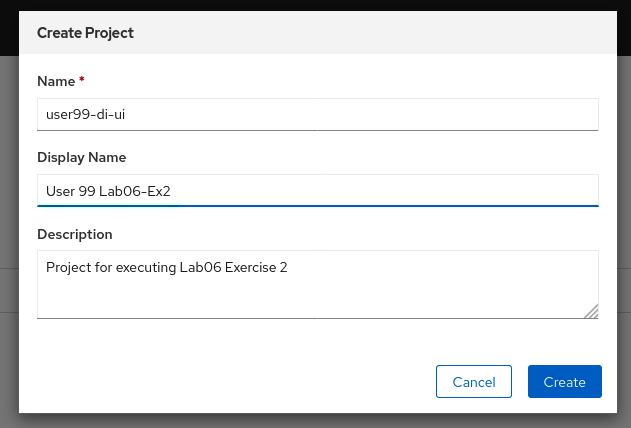
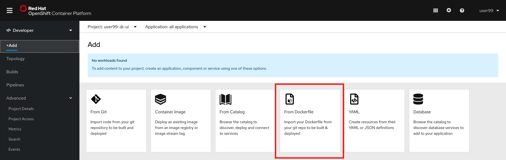
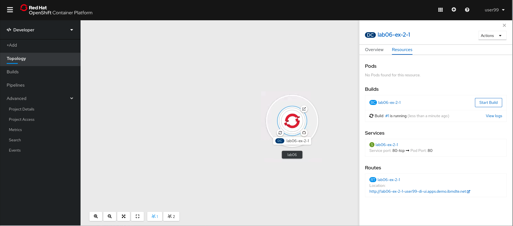
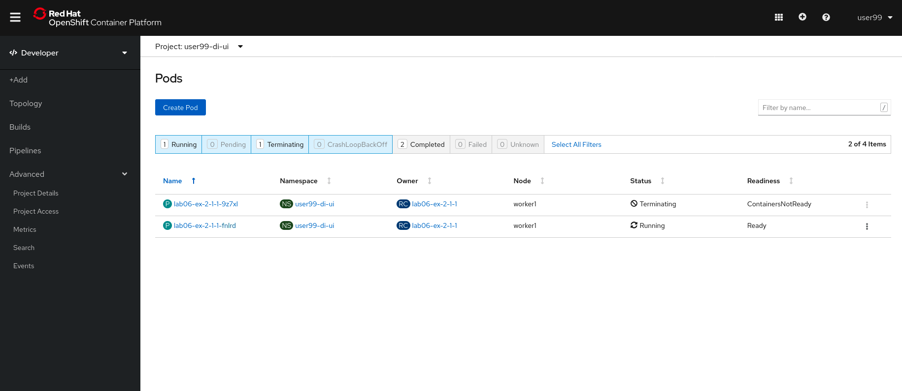
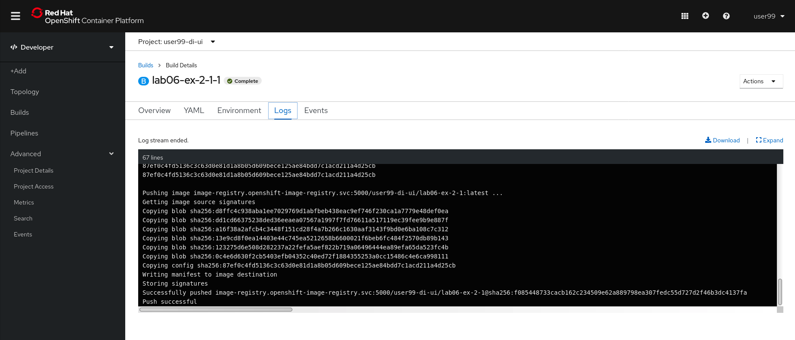
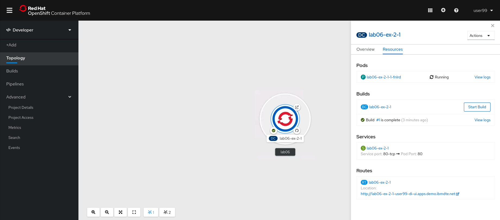
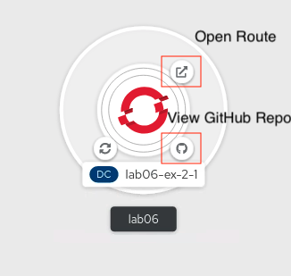
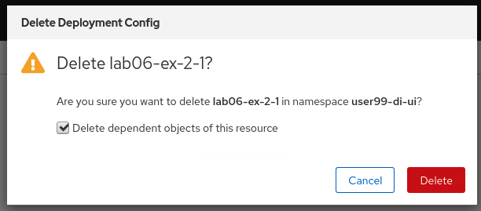
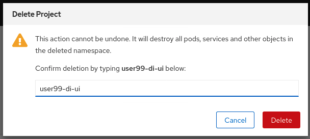

# Exercise 2 - Deploying Applications with a Dockerfile using the Web Console

In this lab we'll explore how to use the OpenShift Web Console to easily deploy an application using a Dockerfile hosted in a GitHub repository. This deployment will create a DeploymentConfig object instead of a regular Deployment.

To get started, log into OpenShift using the Web Console, as described [here](../Getting-started/log-in-to-openshift.md).

Once you're logged in, create a new project for this deployment. Go to Home > Projects in the navigation pane, then select 'Create Project'

In the 'Create Project' dialogue box that appears, use the naming format `userXX-lab06-di-ui`, replacing `userXX` with your user ID. Completing the Display Name and Description fields are recommended, but optional.

At this point, ask your cluster administrator to enable the user of the `anyuid` Security Context Constraint, providing your project name.

In the navigation pane, switch the console view from Administrator to Developer, then select '+Add'. In this lab, we're going to deploy a new application using the 'From Dockerfile' option. This will allow us to specify the location of a Dockerfile, hosted on GitHub as a base to build an entire application.

This will bring up the 'Import from Dockerfile' input form.

Use the following information when you're inputting the data into the UI fields

*Git*
- Git Repo URL: https://github.com/lfloris/openshift-bootcamp
- Show Advanced Git Options > Context Dir: Labs/Lab06-WebUI-application-deployments/python-image

*Dockerfile*
- Dockerfile Path: Dockerfile
- Container Port: 80

*General*
- Application name: lab06
- name: lab06-ex-2-1

*Resources*
Check the radio button 'Deployment Config', so that a DeploymentConfig object is created as a result.

*Advanced Options*
Check the 'Create a route to the application'

Select 'Create'. This will bring you to the topology screen and show you all the applications that have been deployed with the same application name, in this example it was lab06.

For a short time, the process will be in `building` state

During this time we can also view the pods in the project. Here we see that there are two pods - one is the builder pod that perform several tasks, such as fetching the information from GitHub and building the new image from the Dockerfile and pushing the new image to the OpenShift Image Registry.

Inspect the logs of the build pod. You can see all of the steps taken to reach a sucessful build.

Finally, once the process is complete, we should see that the topology view reports a sucessful deployment of our simple Python application.

Using the topology view, we also have some handy icons to take us directly to the application exposed by a Route, and to view the source code on GitHub

As a result of this process, there are a few new resources created, which you an view in the Administrator dashboards:

- BuildConfig
- Build
- ImageStream
- DeploymentConfig
- Service
- Route

Inspect these resources at your leisure, and deploy additional instances of the same python application to see how the topology UI will group the individual applications together based on the `Application name` we used earlier.

To clean up resources and remove the application, switch back to the Administrator view, then select Workloads > Deployment Configs. Select the three dots to the right of the application we just deployed, and select 'Delete DeploymentConfig'.

Select the check box to remove dependent objects, and select 'Delete'.

To remove the project, on the Administrator view, select Home > Projects. Select the three dots to the right of the project name, and select 'Delete Project'. Confirm by typing the name of the project, then select 'Delete'

Lab complete.