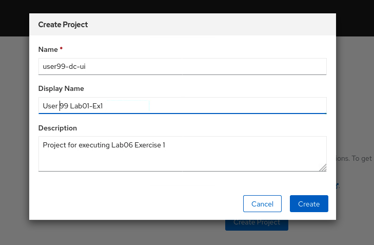
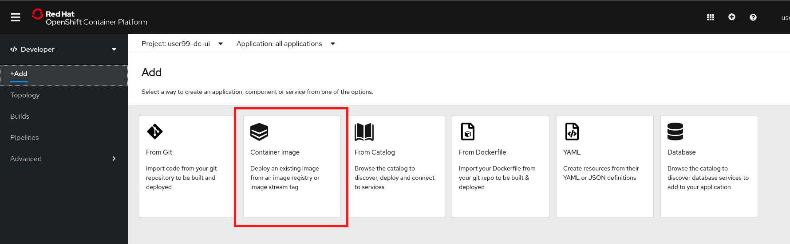
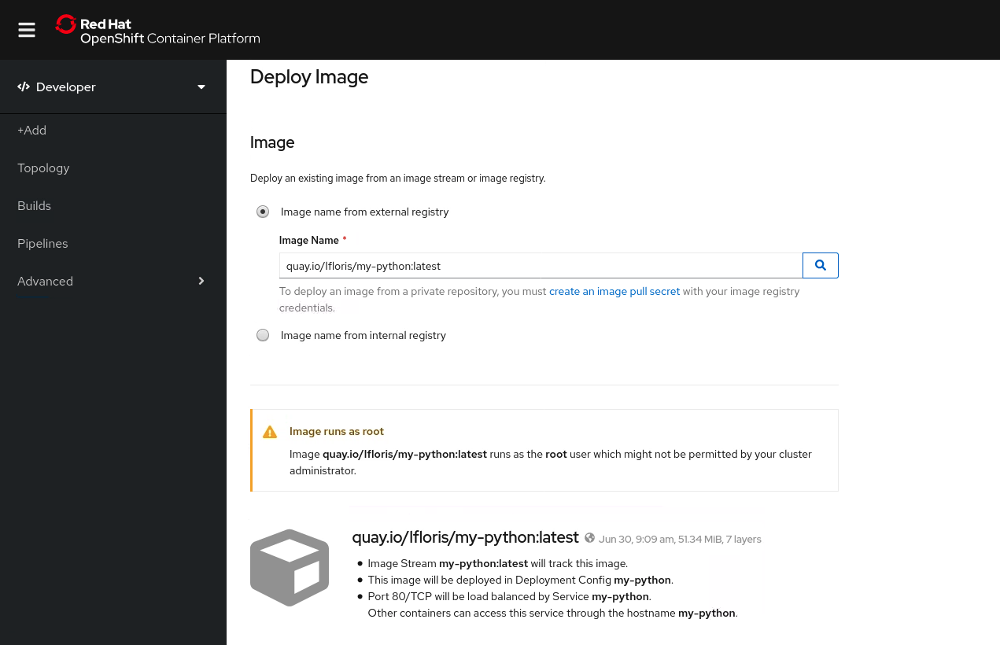
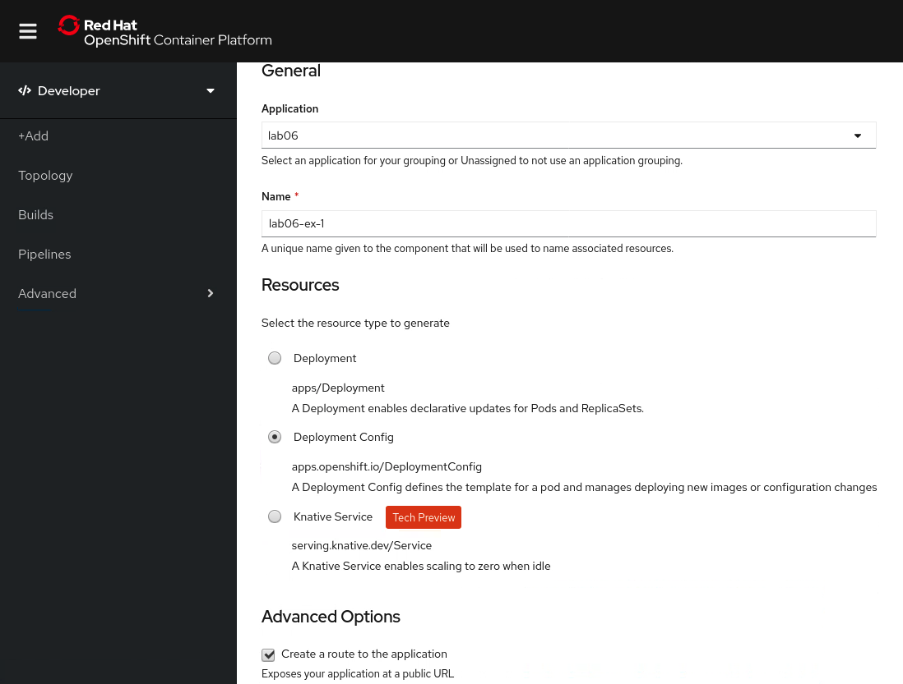
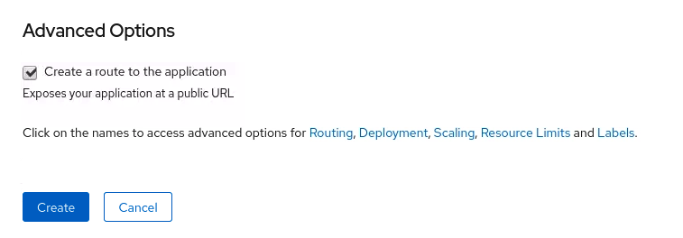
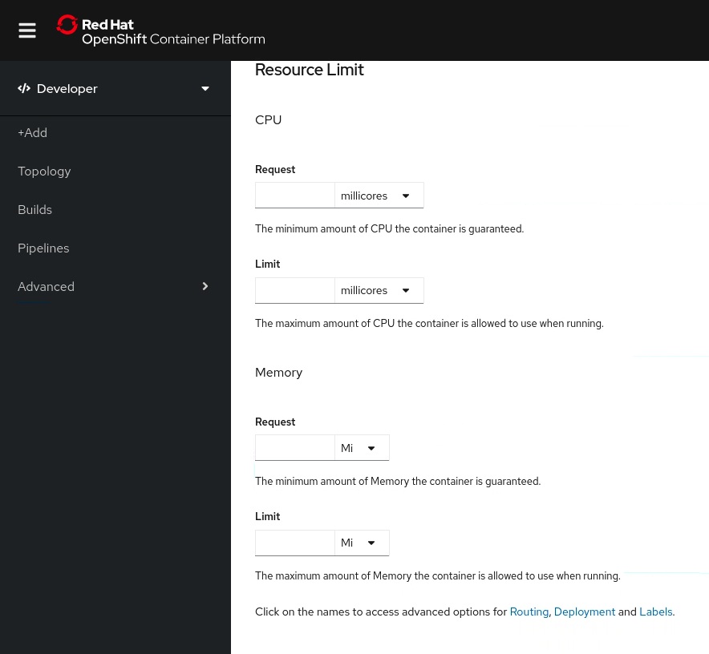
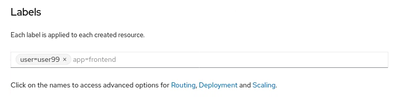
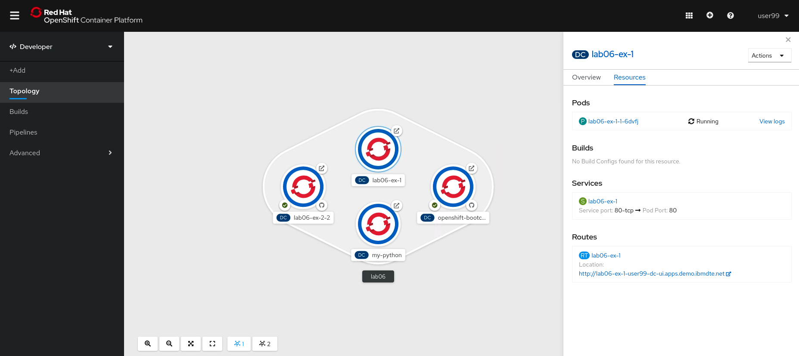
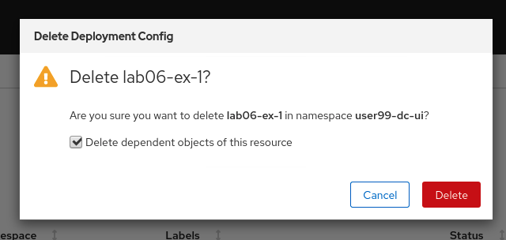
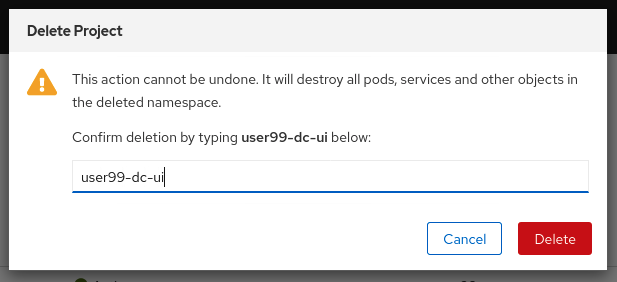

# Exercise 1 - Deploying Applications with a DeploymentConfig using the Web Console

In this lab we'll explore how to use the OpenShift Web Console to easily define and deploy applications

To get started, log into OpenShift using the Web Console, as described [here](../Getting-started/log-in-to-openshift.md).

Once you're logged in, create a new project for this deployment. Go to Home > Projects in the navigation pane, then select 'Create Project'


In the 'Create Project' dialogue box that appears, use the naming format `userXX-lab06-dc-ui`, replacing `userXX` with your user ID. Completing the Display Name and Description fields are recommended, but optional.



In the navigation pane, switch the console view from Administrator to Developer, then select '+Add'. In this lab, we're going to deploy a new application using the 'From Container Image' option. This will allow us to specify the location of a Dockerfile, hosted on GitHub as a base to build an entire application.



You'll then be presented with an input form for us to specify some details about this new deployment configuration.

In the Image Name field, enter 'quay.io/lfloris/my-python:latest`, then select the search icon.



This gives you some information about the immage, including some potential security risks. In this example the container runs as the root user. At this point, as a developer, if you know that you don't have the capabilities to run this container image, you would typically address the issues by creating a new base image and uploading to the target repository, in this case `quay.io`.

You will need to apply the `anyuid` Security Context Constraint (SCC) to your project to allow the container to work correctly. Security Context Constraints will be covered in a later lab. To add the `anyuid` SCC to your project, you would run the following command

```
$ oc adm policy add-scc-to-user anyuid -z default
```

Review some of the other information in this form. For example, change the *Application* drop down to create a new application called `lab06`, and change the *Name* from `my-python` to `lab06-ex-1`.

In the *Resources* section, select the Deployment Config radio button, as we will generate a new DeploymentConfig object from this exercise.2

Then select the check box to create a route to the application.



We also have some advanced options to customise our deployment.



Select 'Resource Limits' and enter the following

*CPU*
- Request: 100m
- Limit: 200m

*Memory*
- Request: 128Mi
- Limit: 256Mi



Also from the advanced options, select 'Labels'

Enter the label `user=userXX` replacing `userXX` with your user ID.



Then select Create.

Our application should now be deploying from the provided image, along with all the other customisations we just made.



You can view the created resources at your leisure. 

To clean up resources and remove the application, switch back to the Administrator view, then select Workloads > Deployment Configs. Select the three dots to the right of the application we just deployed, and select 'Delete DeploymentConfig'.



Select the check box to remove dependent objects, and select 'Delete'.

To remove the project, on the Administrator view, select Home > Projects. Select the three dots to the right of the project name, and select 'Delete Project'. Confirm by typing the name of the project, then select 'Delete'



Lab complete. Please move on to [Deploying Applications from Dockerfiles in the Web UI](building-from-docker-image-ex-2.md)