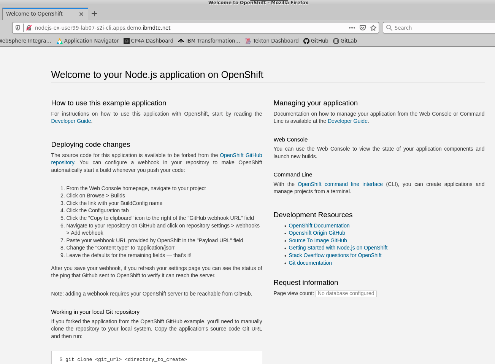

# Exercise 2 - Deploying Applications using Source2Image from the Command Line

In this lab we'll explore how to use the `oc` CLI tool to deploy a similar appliation as in exercise 1. We will use source-to-image strategy to build an image based on application code hosted in a Github repository into the OpenShift Cluster. With the S2I functionality, OpenShift fulfills multiple steps consecutively: compiling code from the code source, building the image and ultimately pushing the image to the internal registry from which the image will later be addressable via an ImageStream.

We use the `oc new-build` command which results in a BuildConfig. S2I is the strategy that the build command will use to build the image. For this, OpenShift takes advantage of so called builder images which are base images to mount the application code to that is hosted in the source repo.

In this lab, we will be using a nodejs builder image.

To get started, log into OpenShift using the CLI, as described [here](../Getting-started/log-in-to-openshift.md).

A set of helpful common `oc` commands can be found [here](../Getting-started/oc-commands.md).

Once you're logged in, create a new project for this deployment.

```
$ oc new-project userXX-lab07-s2i-cli
```

Replace `userXX` with your user ID or other name.

Run the oc new-build command which will pull down the Centos nodejs docker image from Docker Hub.
```
$ oc new-build centos/nodejs-8-centos7~https://github.com/sclorg/nodejs-ex.git
--> Found container image 0e060ab (7 months old) from Docker Hub for "centos/nodejs-8-centos7"

    Node.js 8 
    --------- 
    Node.js 8 available as container is a base platform for building and running various Node.js 8 applications and frameworks. Node.js is a platform built on Chrome's JavaScript runtime for easily building fast, scalable network applications. Node.js uses an event-driven, non-blocking I/O model that makes it lightweight and efficient, perfect for data-intensive real-time applications that run across distributed devices.

    Tags: builder, nodejs, nodejs8

    * An image stream tag will be created as "nodejs-8-centos7:latest" that will track the source image
    * A source build using source code from https://github.com/sclorg/nodejs-ex.git will be created
      * The resulting image will be pushed to image stream tag "nodejs-ex:latest"
      * Every time "nodejs-8-centos7:latest" changes a new build will be triggered

--> Creating resources with label build=nodejs-ex ...
    imagestream.image.openshift.io "nodejs-8-centos7" created
    imagestream.image.openshift.io "nodejs-ex" created
    buildconfig.build.openshift.io "nodejs-ex" created
--> Success
```

After running the command explore what the objects that come as a result of the build command:

```
$ oc get is                                                                                TAGS     UPDATED
NAME        IMAGE REPOSITORY                                                                             TAGS     UPDATED
nodejs-ex   default-route-openshift-image-registry.apps.demo.ibmdte.net/user99-lab07-s2i-cli/nodejs-ex   latest   23 seconds ago
```

Take a note of how the build command created two image streams. Image streams are a way for Openshift to keep a central index of images that are used for deployments. The Image stream point to the internal registry in which the images are stored. At any point, if the image to which the IS points to is renewed, the Imagestream will keep track of that by assigning a new image tag. The build command created two IS one for the builder image and one for the application container image.

```
$ oc get builds
NAME          TYPE     FROM          STATUS     STARTED              DURATION
nodejs-ex-1   Source   Git@f1cd67e   Complete   About a minute ago   54s
```

The command also creates a new resource, called BuildConfig. Run a describe command to get more information on it:

```
$ oc describe build s2i-app
Name:		nodejs-ex-1
Namespace:	user99-lab07-s2i-cli
Created:	2 minutes ago
Labels:		build=nodejs-ex
		buildconfig=nodejs-ex
		openshift.io/build-config.name=nodejs-ex
		openshift.io/build.start-policy=Serial
Annotations:	openshift.io/build-config.name=nodejs-ex
		openshift.io/build.number=1
		openshift.io/build.pod-name=nodejs-ex-1-build

Status:		Complete
Started:	Tue, 30 Jun 2020 13:44:01 PDT
Duration:	54s
  FetchInputs:	  2s
  PullImages:	  20s
  Build:	  21s
  PushImage:	  7s

Build Config:	nodejs-ex
Build Pod:	nodejs-ex-1-build
Image Digest:	sha256:f30c3b0f7bf4d852b1e87926d0e7ad5faa9df18996b1b0b88d93b0a6a038770f

Strategy:		Source
URL:			https://github.com/sclorg/nodejs-ex.git
Commit:			f1cd67e (Merge pull request #221 from 0xflotus/patch-1)
Author/Committer:	Ben Parees / GitHub
From Image:		DockerImage centos/nodejs-8-centos7@sha256:3dfd54c57b791d0b8fc4b4670144920e7ad0c1b0bd7a501375af8421d19df90c
Output to:		ImageStreamTag nodejs-ex:latest
Push Secret:		builder-dockercfg-9bgrk

Build trigger cause:	Build configuration change

Events:
  Type		Reason		Age			From			Message
  ----		------		----			----			-------
  Normal	Scheduled	<unknown>		default-scheduler	Successfully assigned user99-lab07-s2i-cli/nodejs-ex-1-build to worker1
  Normal	Pulled		2m21s			kubelet, worker1	Container image "quay.io/openshift-release-dev/ocp-v4.0-art-dev@sha256:a079d14d21864283f048719b9ad8454c81a5e0ea79a71ca50446119345a84a66" already present on machine
  Normal	Created		2m21s			kubelet, worker1	Created container git-clone
  Normal	Started		2m21s			kubelet, worker1	Started container git-clone
  Normal	BuildStarted	2m20s			build-controller	Build user99-lab07-s2i-cli/nodejs-ex-1 is now running
  Normal	Created		2m18s			kubelet, worker1	Created container manage-dockerfile
  Normal	Pulled		2m18s			kubelet, worker1	Container image "quay.io/openshift-release-dev/ocp-v4.0-art-dev@sha256:a079d14d21864283f048719b9ad8454c81a5e0ea79a71ca50446119345a84a66" already present on machine
  Normal	Started		2m18s			kubelet, worker1	Started container manage-dockerfile
  Normal	Pulled		2m17s			kubelet, worker1	Container image "quay.io/openshift-release-dev/ocp-v4.0-art-dev@sha256:a079d14d21864283f048719b9ad8454c81a5e0ea79a71ca50446119345a84a66" already present on machine
  Normal	Created		2m17s			kubelet, worker1	Created container sti-build
  Normal	Started		2m17s			kubelet, worker1	Started container sti-build
  Normal	BuildCompleted	89s (x2 over 89s)	build-controller	Build user99-lab07-s2i-cli/nodejs-ex-1 completed successfully
```

So we can see here some of the actions completed in the events. The `Status` says `Complete` and the last few events also say `BuildCompleted`, which is also another good sign.

Go ahead and deploy the application while specifying the newly created IS:
```
$ oc new-app -i=nodejs-ex --name=nodejs-e
--> Found image 0ef6040 (4 minutes old) in image stream "user99-lab07-s2i-cli/nodejs-ex" under tag "latest" for "nodejs-ex"

    Node.js 8 
    --------- 
    Node.js 8 available as container is a base platform for building and running various Node.js 8 applications and frameworks. Node.js is a platform built on Chrome's JavaScript runtime for easily building fast, scalable network applications. Node.js uses an event-driven, non-blocking I/O model that makes it lightweight and efficient, perfect for data-intensive real-time applications that run across distributed devices.

    Tags: builder, nodejs, nodejs8

    * This image will be deployed in deployment config "nodejs-ex"
    * Port 8080/tcp will be load balanced by service "nodejs-ex"
      * Other containers can access this service through the hostname "nodejs-ex"

--> Creating resources ...
    deploymentconfig.apps.openshift.io "nodejs-ex" created
    service "nodejs-ex" created
--> Success
    Application is not exposed. You can expose services to the outside world by executing one or more of the commands below:
     'oc expose svc/nodejs-ex' 
    Run 'oc status' to view your app.
```

Run `oc status` to view the current status of the application

```
$ oc status
In project user99-lab07-s2i-cli on server https://api.demo.ibmdte.net:6443

svc/nodejs-ex - 172.30.213.227:8080
  dc/nodejs-ex deploys istag/nodejs-ex:latest <-
    bc/nodejs-ex source builds https://github.com/sclorg/nodejs-ex.git on istag/nodejs-8-centos7:latest 
    deployment #1 deployed 36 seconds ago - 1 pod

bc/my-demo-app source builds https://github.com/monodot/openshift-demos on istag/s2i-java:latest
  -> istag/my-demo-app:latest
  not built yet

Errors:
  * bc/my-demo-app is pushing to istag/my-demo-app:latest, but the image stream for that tag does not exist.

1 error, 3 warnings, 3 infos identified, use 'oc status --suggest' to see details.
```

Ensure, the application pod is up and running

```
$ oc get pods
NAME                 READY   STATUS      RESTARTS   AGE
nodejs-ex-1-8fxp4    1/1     Running     0          52s
nodejs-ex-1-build    0/1     Completed   0          5m58s
nodejs-ex-1-deploy   0/1     Completed   0          55s
```

Expose the service associated with the new app

```
$ oc get service
NAME        TYPE        CLUSTER-IP       EXTERNAL-IP   PORT(S)    AGE
nodejs-ex   ClusterIP   172.30.213.227   <none>        8080/TCP   99s

$ oc expose service nodejs-ex
route.route.openshift.io/nodejs-ex exposed

$ oc get route
NAME        HOST/PORT                                             PATH   SERVICES    PORT       TERMINATION   WILDCARD
nodejs-ex   nodejs-ex-user99-lab07-s2i-cli.apps.demo.ibmdte.net          nodejs-ex   8080-tcp                 None
```

We can `curl` the route directly from the command line, 

```
$ curl -s $(oc get route nodejs-ex -o jsonpath='{..spec.host}{"\n"}')

<html>...</html>
```

Or by visiting the URL in a browser and the response should be the landing page for NodeJS.



To clean up the resources, run the following commands

```
$ oc delete deploymentconfig/nodejs-ex buildconfig/nodejs-ex is/
deploymentconfig.apps.openshift.io "nodejs-ex" deleted
imagestream.image.openshift.io "nodejs-ex" deleted
buildconfig.build.openshift.io "nodejs-ex" deleted
```

Delete the projet

```
$ oc delete project user99-lab07-s2i-cli
project.project.openshift.io "user99-lab07-s2i-cli" deleted
```

Lab complete.