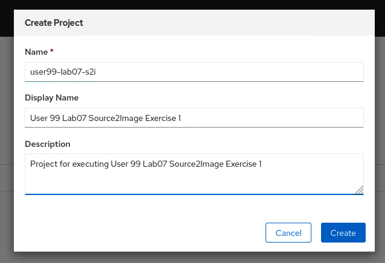
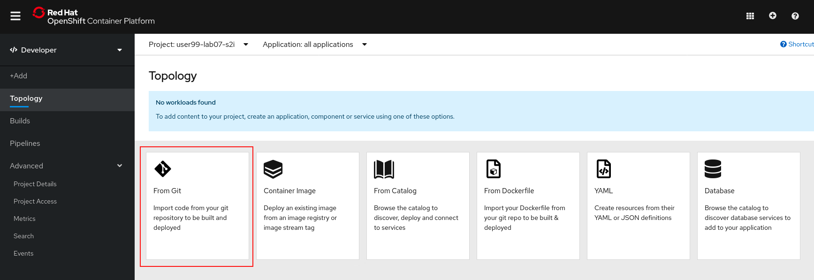
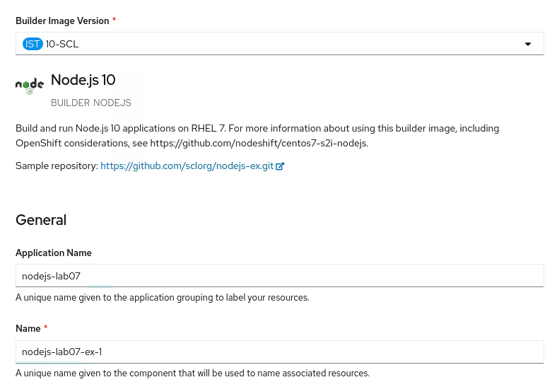
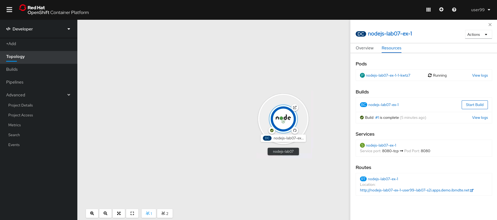
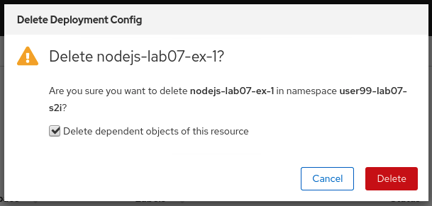
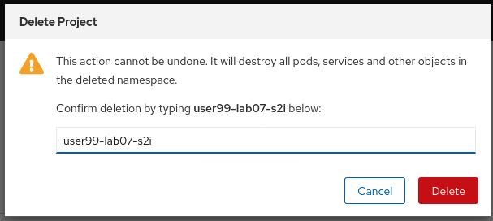

# Exercise 1 - Deploying Applications using Source2Image from the Web Console

In this lab you'll use the OpenShift Web Console to deploy an application using the Source2Image methods.

To get started, log into OpenShift using the Web Console, as described [here](../Getting-started/log-in-to-openshift.md).

Once you're logged in, create a new project for this deployment. Go to Home > Projects in the navigation pane, then select 'Create Project'

In the 'Create Project' dialogue box that appears, use the naming format `userXX-lab06-dc-ui`, replacing `userXX` with your user ID. Completing the Display Name and Description fields are recommended, but optional.

In the navigation pane, switch the console view from Administrator to Developer, then select '+Add'. In this lab, we're going to deploy a new application using the 'From Container Image' option. This will allow us to specify the location of a Dockerfile, hosted on GitHub as a base to build an entire application.

You'll then be presented with an input form for us to specify some details about this new deployment configuration.

For the* Git Repo URL*, use `https://github.com/sclorg/nodejs-ex.git`.

For the *Application Name* use `lab07`, and for the *Name* use `nodejs-lab07-ex-1`.

Then select 'Create'.

This will start pulling the source code from the `https://github.com/sclorg/nodejs-ex.git` Git repository, building an image, pushing the image to the internal registry, and then building a container from this image.

Review the other resources created at your leisure.

To clean up resources and remove the application, switch back to the Administrator view, then select Workloads > Deployment Configs. Select the three dots to the right of the application we just deployed, and select 'Delete DeploymentConfig'.

Select the check box to remove dependent objects, and select 'Delete'.

To remove the project, on the Administrator view, select Home > Projects. Select the three dots to the right of the project name, and select 'Delete Project'. Confirm by typing the name of the project, then select 'Delete'

Lab complete. Please move on to [Deploying Applications with Source2Image in the CLI](s2i-cli-ex-2.md)