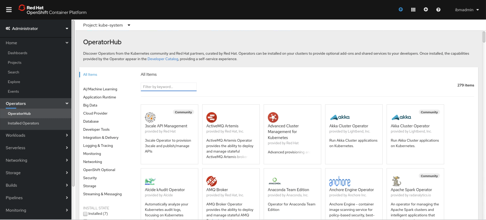
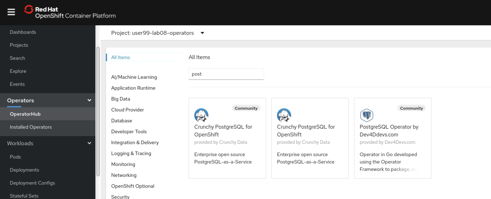
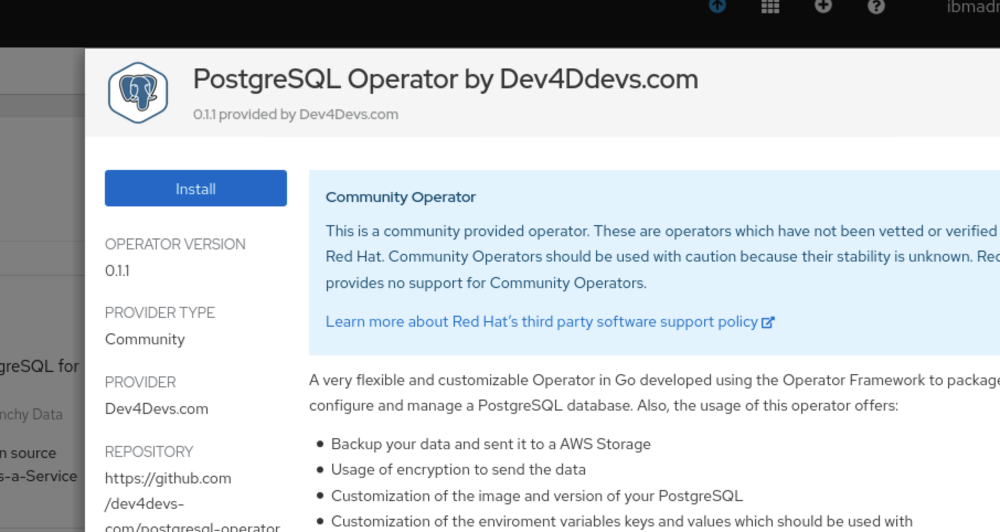
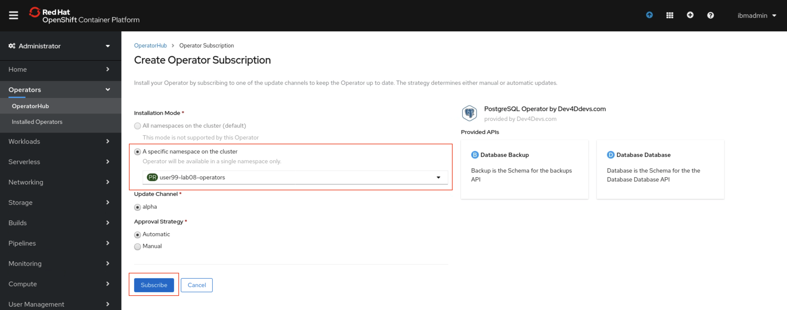
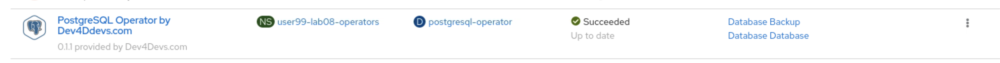
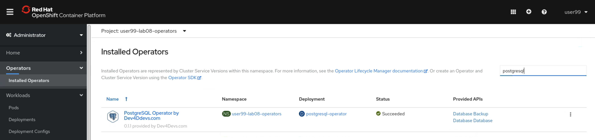
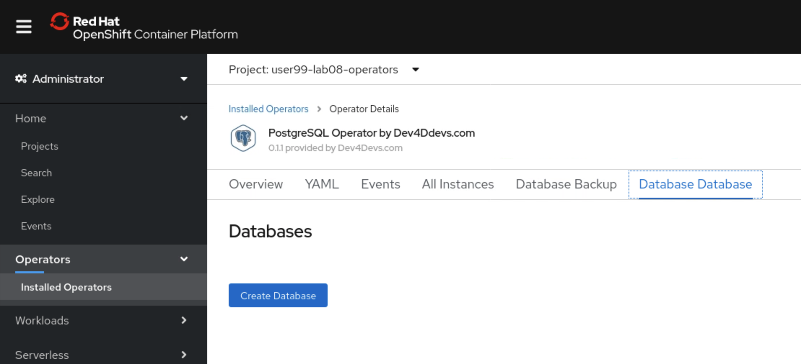
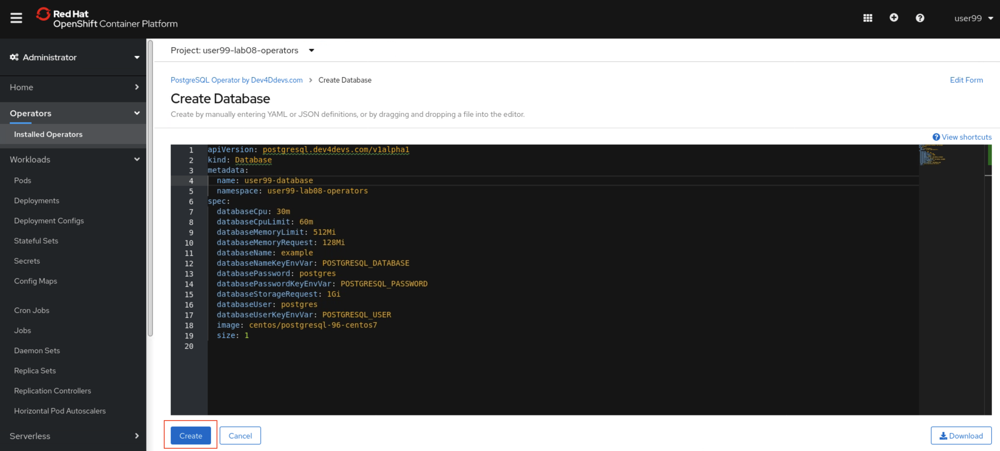
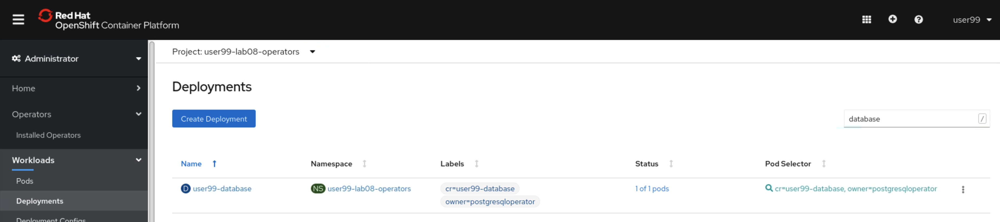
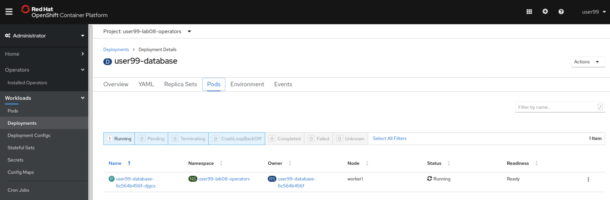

# Exercise 1 - Deploying an Operator

In this lab you'll explore how the cluster administrator can make a PostgreSQL Operator available from the OperatorHub to other users in the cluster so they can install PostgreSQL applications managed by the PostgreSQL Operator.

This lab will be executed in three parts

1. Use the developer to create the project
2. Use the Cluster Administrator to install the Operator
3. Use the developer to create the application from the installed Operator

## Part 1 - Create the Project

First we need to log in with a non-admin role and create a project similar to `lab08-operators`. For the developer role, we'll use the `ibmuser` user.

Log into OpenShift using the CLI with the user `ibmuser`, as described [here](../Getting-started/log-in-to-openshift.md).

Create the project as this user

```
$ oc new-project lab08-operators
```

## Part 2 - Install the Operator

Now we should take the role of the Cluster Administrator to make the PostgreSQL Operator available.

Log in as the cluster-admin `ibmadmin` user. Only administrative users can install operators to projects. Once an operator has been installed to a project, developers with access to that project can consume the operator Custom Resources to create applications.

```
$ oc login https://api.demo.ibmdte.net:6443 -u ibmadmin -p engageibm
```

From the navigation pain, select Operators > OperatorHub



In the search bar, enter `postgresql` and then select the PostgreSQL Operator



Select 'Install'



On the Subscription page, select the option for 'A specific namespace in the cluster', then select the namespace you created in Part 1.



Select 'Subscribe'

The PostgreSQL Operator should begin installing to the selected project. 



This may take a short amount of time to start up. 

The existing user `ibmuser` only has a basic-user role, so we need to upgrade some of their privileges to they can create and edit resources in the `lab08-operators` project. Do this with the following

```
$ oc adm policy add-role-to-user edit ibmuser -n lab08-operators
```


While we're logged in as an admin user, let's take a look at the resources that were created as a result of deploying an operator from the User Interface.

When you deploy an operator using the User Interface, the OpenShift Operator Lifecycle Manager will create two resources for you; an OperatorGroup for the specific namespace and a Subscription for the operator you installed. To view the OperatorGroup, use the command `oc -n <namespace> get operatorgroup <name>`. For the PostgreSQL operator we just deployed, we don't know the name of the OperatorGroup created for us so we have to find it using `oc -n lab08-operators get operatorgroup`

```
$ oc -n lab08-operators get operatorgroup
NAME                    AGE
lab08-operators-hx4qr   17s
```

We can use this name to get more information about the `lab08-operators-hx4qr` OperatorGroup

```
$ oc -n lab08-operators describe operatorgroup lab08-operators-hx4qr
Name:         lab08-operators-hx4qr
Namespace:    lab08-operators
Labels:       <none>
Annotations:  olm.providedAPIs: Backup.v1alpha1.postgresql.dev4devs.com,Database.v1alpha1.postgresql.dev4devs.com
API Version:  operators.coreos.com/v1
Kind:         OperatorGroup
Metadata:
  Creation Timestamp:  2020-10-26T21:23:41Z
  Generate Name:       lab08-operators-
  Generation:          1
  Resource Version:    2373071
  Self Link:           /apis/operators.coreos.com/v1/namespaces/lab08-operators/operatorgroups/lab08-operators-hx4qr
  UID:                 c111d0b9-bc50-434c-a1fd-21bd3b8dae67
Spec:
  Target Namespaces:
    lab08-operators
Status:
  Last Updated:  2020-10-26T21:23:41Z
  Namespaces:
    lab08-operators
Events:  <none>
```

We can also view this resource in YAML output, which is useful for saving the YAML format just in case we want to create similar resource at a later date. We can use the `--export` flag to remove any deployment specific data such as timestamps and status fields

```
$ oc -n lab08-operators get operatorgroup lab08-operators-hx4qr -o yaml --export
Flag --export has been deprecated, This flag is deprecated and will be removed in future.
apiVersion: operators.coreos.com/v1
kind: OperatorGroup
metadata:
  annotations:
    olm.providedAPIs: Backup.v1alpha1.postgresql.dev4devs.com,Database.v1alpha1.postgresql.dev4devs.com
  generateName: lab08-operators-
  generation: 1
  selfLink: /apis/operators.coreos.com/v1/namespaces/lab08-operators/operatorgroups/lab08-operators-hx4qr
spec:
  targetNamespaces:
  - lab08-operators
```

Next, view the Subscription created for the PostgreSQL operator using a similar approach to getting information about the  OperatorGroup

```
$ oc -n lab08-operators get subscriptions
NAME                               PACKAGE                            SOURCE                CHANNEL
postgresql-operator-dev4devs-com   postgresql-operator-dev4devs-com   community-operators   alpha

$ oc -n lab08-operators get subscriptions postgresql-operator-dev4devs-com -o yaml --export
Flag --export has been deprecated, This flag is deprecated and will be removed in future.
apiVersion: operators.coreos.com/v1alpha1
kind: Subscription
metadata:
  generation: 1
  name: postgresql-operator-dev4devs-com
  selfLink: /apis/operators.coreos.com/v1alpha1/namespaces/lab08-operators/subscriptions/postgresql-operator-dev4devs-com
spec:
  channel: alpha
  installPlanApproval: Automatic
  name: postgresql-operator-dev4devs-com
  source: community-operators
  sourceNamespace: openshift-marketplace
  startingCSV: postgresql-operator.v0.1.1
```

The Subscription resource provides some interesting information about where the operator comes from, in terms of OpenShift resources. For example, the `source` field tells us what catalog the operator comes from, and the `name` field provides the resource name of the operator. We can use that information to get more information about all of the available channels and versions of the operator. We do this by checking the PackageManifests object for the name `postgresql-operator-dev4devs-com`

```
$ oc get packagemanifests postgresql-operator-dev4devs-com
NAME                               CATALOG               AGE
postgresql-operator-dev4devs-com   Community Operators   124d
```

Check the output of the command `oc describe packagemanifests postgresql-operator-dev4devs-com`. This produces quite a lot of output, but buried in that output are two fields that match the `channel` and `startingCSV` fields we saw in the Subscription. The output is a list of Channel objects. Each object has a `Name` field with a value and each object also has a `currentCSV`. Both match with the Subscription definition. If we were to deploy this from the command line instead, we'd need to search through the PackageManifest for this information for the operator we want to deploy and build up a Subscription object. As you can see, deploying from the User Interface has made this process a lot easier and more transparent. It's also worth noting that the PackageManifest object also contains the specification for the Custom Resources that you're able to create for this operator. You'll see how they look to an end user in th next few steps.

We can now log out of the Web Console with the `ibmadmin` user and log in again with our developer user.

## Part 3 - Install a Database from the PostreSQL Operator

Now log back into the Web Console as the developer user `ibmuser`.

From the project selection box, select the project you created at the start of this lab, for example, `lab08-operators`. In the navigation pane, select Operators > Installed Operators, then select the PostgreSQL Operator. You may need to use the search box if you have a lot of Operators installed to this project.



What you may notice here is that both of the tabs `Database Backup` and `Database Database` are the same two objects that we saw present in the PackageManifest earlier on.

Select the 'Database Database' tab.



This page will allow you to create a new instance of a PostgreSQL database. The YAML provided is perfectly valid to deploy as it is, so we do not need to make any changes. Use the below YAML as an example.

```
apiVersion: postgresql.dev4devs.com/v1alpha1
kind: Database
metadata:
  name: database
  namespace: lab08-operators
spec:
  databaseCpu: 30m
  databaseCpuLimit: 60m
  databaseMemoryLimit: 512Mi
  databaseMemoryRequest: 128Mi
  databaseName: example
  databaseNameKeyEnvVar: POSTGRESQL_DATABASE
  databasePassword: postgres
  databasePasswordKeyEnvVar: POSTGRESQL_PASSWORD
  databaseStorageRequest: 1Gi
  databaseUser: postgres
  databaseUserKeyEnvVar: POSTGRESQL_USER
  image: centos/postgresql-96-centos7
  size: 1
```



When ready, select 'Create'.

This should begin the deployment process and we can check the state of our new database pods.

In the navigation pane, go to Workloads > Deployments then select the `database`, or the name you gave to your database application in the previous step.



Here, we can select the 'Pods' tab and see if our PostgreSQL database pod is running.



We have successfully installed an Operator in a developer project and the developer user has created a new application from this Operator.

Lab complete. Please move on to [Deploying an Operator from the CLI](operator-deployment-cli-ex-2.md)

When you're finished, please clean up the resources created and delete the project.