# Exercise 1 - Deploying Applications with Jenkins CI/CD

In this lab we'll explore how to use Jenkins to build and deploy application on OpenShift.
Sample Guest book application is used that uses IBM Liberty and Mongo DB. 

## Setup projects
To get started, log into OpenShift using the Web Console, as described [here](../Getting-started/log-in-to-openshift.md).

Once you're logged in, create a new project for this deployment. Go to Home > Projects in the navigation pane, then select 'Create Project'


In the 'Create Project' dialogue box that appears, use the naming format `lab13-jenkins`. Completing the Display Name and Description fields are recommended, but optional.

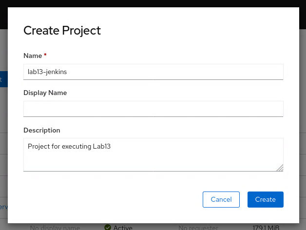

In the similar way create additional project named `lab13-jenkins-prod` which will represent production release of the application.

## Deploy Mongo DB
The application is using Mongo DB to store guests data. We need to deploy it to our cluster first. 
In this lab, we're going to deploy a Mongo DB using the 'From Catalog' option. This option allows to deploy images that are available in your OpenShift cluster. In the navigation pane, switch the console view from Administrator to Developer, then select '+Add', and click 'From Catalog' option. In the text field start typing `mongo`. For simplicity we will use ephemeral version of this database. If you dont see Mongo Template make sure that all types are unchecked.


Click `Instantiate Template` to deploy Mongo DB instance in your project.

In the template provide following details:

- Make sure that namespace displays "PR lab13-jenkins"
- MongoDB Connection Username: mongo
- MongoDB Connection Password: mongo
- MongoDB Database Name: mydb
- MongoDB Admin Password: mongo

Accept other defalut values and click `Create` button.

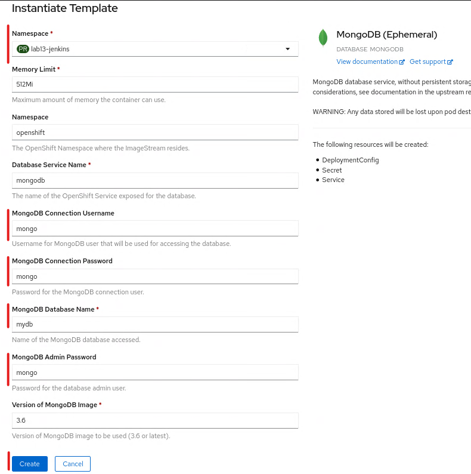


To verify that instance is correctly deployed switch to the 'Administator' view, and click 'Workloads > Pods'. You should have pod with mongo successfully running.

## Deploy Jenkins
We will use Jenkins to build and deploy our application. Jenkis is a CI/CD tool, we will use it to execute pipeline, that will build and deploy the application. 
Again we will use 'From Catalog' option, as the Jenkins template is provided with OpenShift. 

In the navigation pane, switch the console view from Administrator to Developer, then select '+Add', and click 'From Catalog' option. In the text field start typing `jenkins`. Select first template.

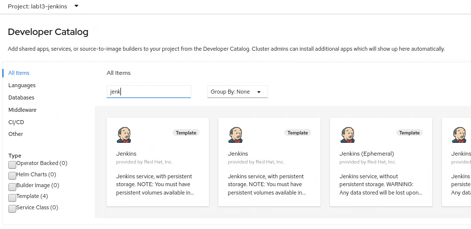

Click `Instantiate Template` to deploy Jenkins instance in your project.

To verify that instance is correctly deployed switch to the 'Administator' view, and click 'Workloads > Pods'. You should have pod with jenkins successfully running. Once the pod is running correctly, we can access Jenkins console.

Expand 'Networking > Routes` and click link to Jenkins console.

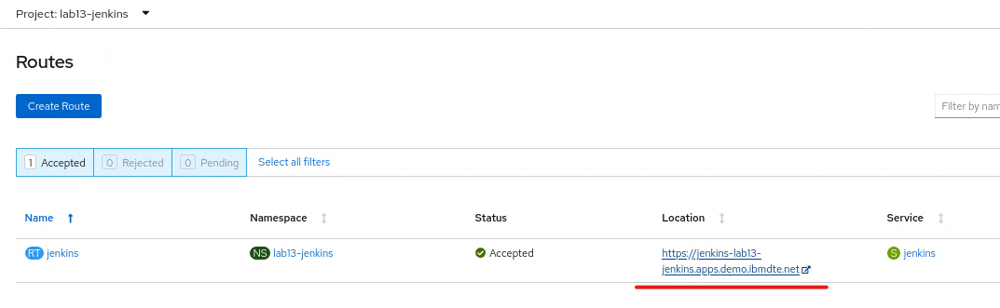

Accept warings displayed in the browser.

Click 'Log in with OpenShift' button. In the login window select `htpasswd`


Click `Log in` button, credentails should be prefilled (ibmadmin).

Accept Authorization request for the jenkins service account:

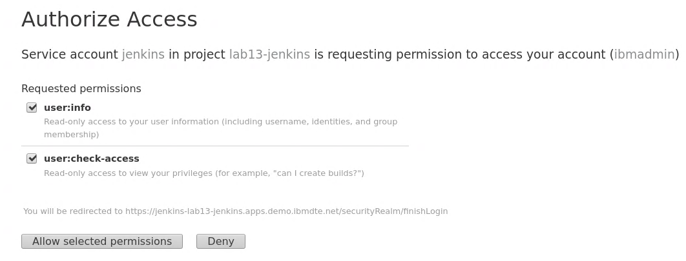

Jenkins welcome screen should appear:

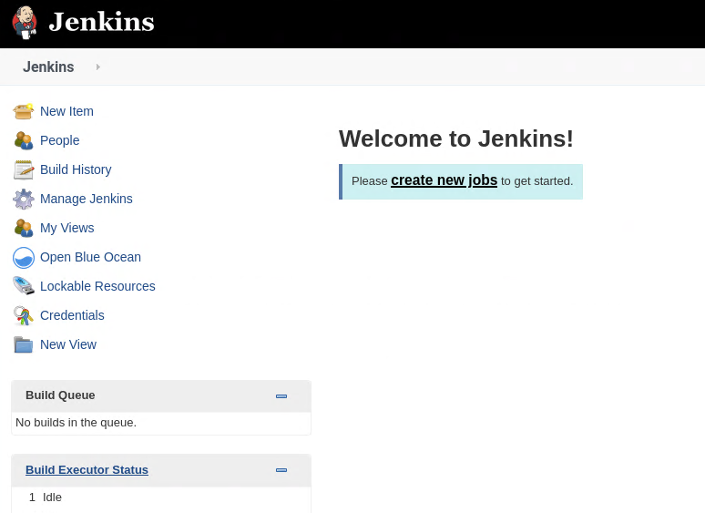

Jenkins is successfully running.

### Update the Jenkins service account

During provisioning of the Jenkins a service account with the name jenkins is created. This service account has privileges to create new artifacts only in the project that it is running in. In this scenario Jenkins will need to create artifacts in addition in `prod` project.

Issue the commands below to allow the jenkins service account to edit artifacts in these project:

```
oc policy add-role-to-user edit system:serviceaccount:lab13-jenkins:jenkins -n lab13-jenkins-prod
```

## Create deployment resources

In this step resources for the build process will be loaded in to the build project. The resources provided here define the following artifacts:

- An ImageStream for the application image. This will be populated by the Jenkins Pipeline
- An ImageStream for WebSphere Liberty which will pull down the latest version of the ibmcom/websphere-liberty:kernel-ubi-min image and will monitor DockerHub for any updates.
- A  `dockerStrategy` BuildConfig that will be used by the Jenkins Pipeline to build the application Docker image
- A `jenkinsPipelineStrategy` BuildConfig that defines the Pipeline using the Jenkinsfile in GitHub


To get started, log into OpenShift using the CLI, as described [here](../Getting-started/log-in-to-openshift.md). We could define these resources via Web UI, but it is much less error prone, and more repeatable to use yaml files.

A set of helpful common `oc` commands can be found [here](../Getting-started/oc-commands.md).

### Define resources in the build namespace

Go to the `openshift` directory and execute the following commands:

```
oc project lab13-jenkins
oc create -f imagestream-app.yaml
oc create -f imagestream-liberty.yaml
oc create -f build-image.yaml
oc create -f build-config.yaml
```

You can verify via console that resouces were successfully created:

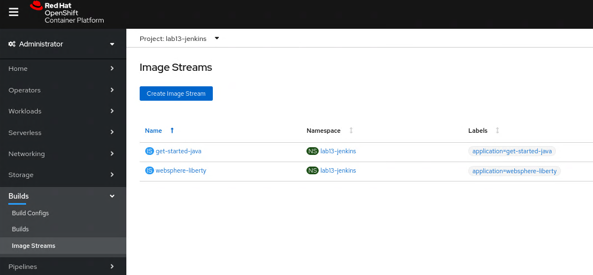


Jenkins build config will use the pipeline definition stored in the project repository in the `Jenkins` file. You may see its contents [here](https://github.com/gasgithub/get-started-java/blob/master/Jenkinsfile). In some cases you may have separate repository (gitops) which would hold your pipeline definitions and resource definitions.

This pipeline will build and deploy application image to OpenShift.

Application image is build using the following [Dockerfile](https://github.com/gasgithub/get-started-java/blob/master/Dockerfile)

Pipeline is using `deployment.yaml` file, which defines application related resources, that are required to create and run application. You may see its contents [here](https://github.com/gasgithub/get-started-java/blob/master/k8s/Jenkinsfile).


### Define resources in the prod namespace
In addition we need to define imagestream resources also in the production space:

```
oc project lab13-jenkins-prod
oc create -f imagestream-app.yaml
oc create -f imagestream-liberty.yaml
```

## Run the pipeline on OCP via Web UI

The newly created pipeline can be started from the RedHat OpenShift console which allows access to the Jenkins logs but also tracks the progress in the OCP console.

In the console, select 'Builds > Build Configs', then click 3 dots on the right and select `Start Build` from the popup menu.

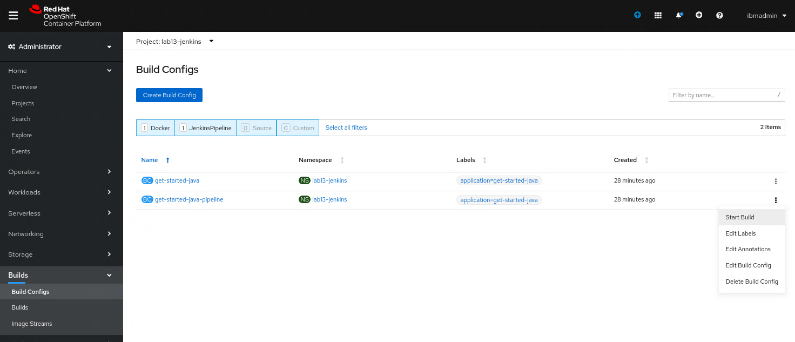


When the pipeline starts, click the view log link to go to the Jenkins administration console. Note that it may take a couple of minutes before the view log link appears on the first pipeline build 

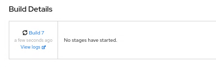

When prompted, log in with your OpenShift account and grant the required access permissions. The Jenkins console log will be displayed as shown below: 

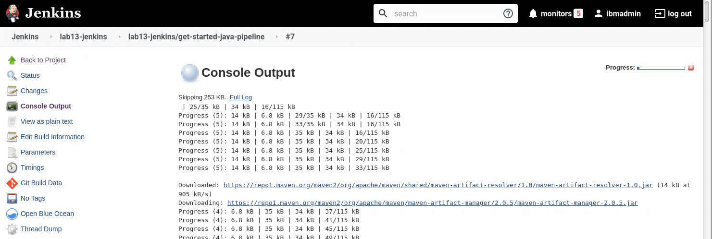

Return to the OpenShift Console and track the progress of the pipeline 

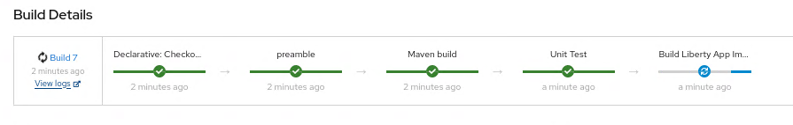

The pipeline will eventually stop at the Promotion Gate for approval to deploy to Production. Click the `Input Required` link as shown below

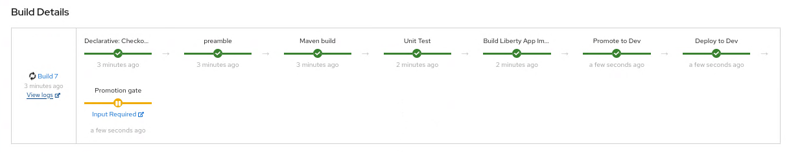

When the Promote application to Production question is displayed, click Proceed

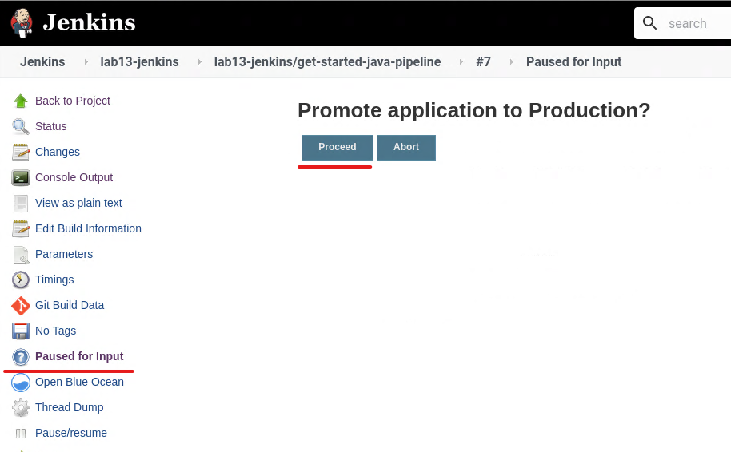

Return to the OpenShift Console and validate that the pipeline is now complete.

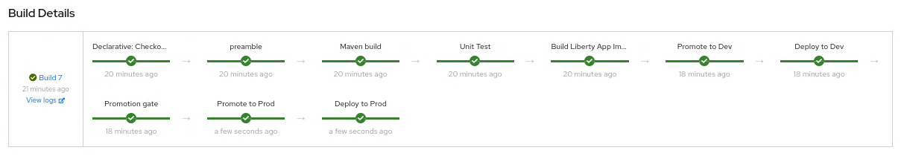


## Validate deployed applicaton

Now that the pipeline is complete, validate the application is deployed and running in build and prod namespaces.

